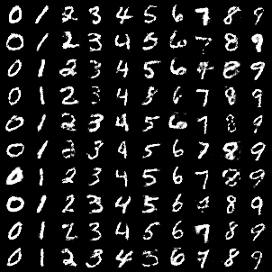
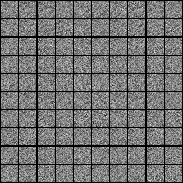

# Pytorch Conditional WGAN with Gradient Penalty
Pytorch implementation of a Conditional [WGAN](https://arxiv.org/abs/1701.07875) with [Gradient Penalty (GP)](https://arxiv.org/abs/1704.00028).

This implementation is adapted from the Conditional GAN and WGAN-GP implementations from this [amazing repository](https://github.com/eriklindernoren/PyTorch-GAN) with many different GAN implementations.

# Usage
Just run

```
python main.py
```

It will create an `images` directory and save generated images every few iterations.

It can be trained with MNIST (default) or Fashion-MNIST just by adding the flag `--dataset fashion`.

<p align="center">
    
</p>
<p align="center">
    Example of the images generated by the model, conditioned by class.
</p>

Generated samples evolution as training progresses:
<p align="center">
    
</p>
